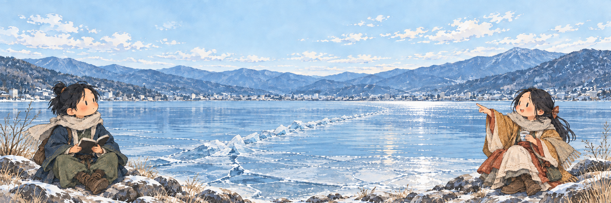

# Suwa Winter Notebook

**Version 0.4.0-beta.1 · 2026-09-20 · Created by Ritsu with AI collaboration**

An interactive notebook about Lake Suwa and Omiwatari (御神渡り): browse 150 winters, explore a hypothetical short stay, and read about the lake, its deities, and the people who record it.

This is a historical exploration tool, not a forecast or a travel-success calculator. Missing records remain visible as missing records.

**Repository:** [RitsuTsao/suwa-winter-notebook](https://github.com/RitsuTsao/suwa-winter-notebook), public with Ritsu's explicit approval. The beta uses GitHub Pages with a daily RSS refresh workflow. The website interface remains in Traditional Chinese; repository documentation is in English, with original Japanese names and source titles where useful.

**Beta website:** [Open Suwa Winter Notebook](https://ritsutsao.github.io/suwa-winter-notebook/). Deployment evidence and scheduler limits are recorded in [VERIFICATION.md](VERIFICATION.md).

## Creator and AI disclosure

**Ritsu** is the project creator and producer, responsible for the concept, product direction, requirements, visual preferences, scope decisions, and user acceptance testing. This project is not presented as software, research, or artwork made by Ritsu alone.

| Collaborator | Model/version disclosure | Contribution |
| --- | --- | --- |
| ChatGPT | **GPT-5.6 Sol**, confirmed by Ritsu for the GitHub planning package | Product ideas, README and roadmap proposals; earlier planning conversations have no retained exact model version |
| OpenAI Codex | **GPT-6** for the repository preparation session; exact deployment identifier not exposed | Implementation, data integration and review, tests, English documentation, repository preparation; earlier sessions are not retroactively assigned this version |
| Google Gemini | **Gemini 3.1 Pro with extended thinking**, as specified by Ritsu for historical research; no backend identifier retained | Historical research handoffs; RSS discovery also used a UI labeled Pro / extended thinking, with exact model version unrecorded for that separate task |
| OpenAI image generation in Codex (`imagegen`) | Exact image-model version not exposed in retained generation records | AI-generated lake scenes and character illustrations, including reference-guided edits |

AI assistance includes substantial code, writing, research-processing, and image production. AI output is not itself historical evidence. See [CREDITS.md](CREDITS.md) for attribution, version evidence, and gaps in the record.



*AI-generated artwork used by the website, not a full UI screenshot or a reconstruction of any particular winter.*

## Explore the notebook

- Browse winters from 1877 to 2026 using a slider, arrows, year grid, or random recorded year.
- Select an arrival date and a stay of 2–7 nights; drag the selected date band to compare it with recorded events.
- Read annual notes that distinguish appearance, sighting, recognition, ceremony, ice cover, and annual outcome.
- Inspect twenty-winter rolling proportions, date markers, and coverage; export annual records as CSV.
- Use the sticky 01–04 navigation to jump between the stay explorer, notes, historical overview, and lake-side stories.
- Switch among three illustrated record states. Open a separate legend vignette or read the latest available RSS headlines in the fourth story tab.

Try 2018, 2026, and 1960: respectively, a recorded occurrence with conflicting first dates; a winter with complete ice cover but no Omiwatari; and a winter whose annual record is still unresolved.

## Run locally

### Offline

Open `dist/index.html` directly in a browser. Historical data, artwork, and interactions are local. No account, API key, CDN, or LLM API is required. News is a saved snapshot, with its retrieval time shown.

### With the optional RSS service

On macOS, double-click `開啟觀測冊.command` (the existing “Open notebook” launcher), or run from the repository root:

```sh
python3 -B tools/serve.py --open
```

This requires an existing Python 3 installation and `curl`. On macOS, the system curl performs HTTPS certificate verification; no Python packages need to be installed. The service listens only on `127.0.0.1`, normally at `http://127.0.0.1:8767/`. Keep the terminal open; press Control+C to stop. Nothing is installed as a background service. Other operating systems have not been validated.

GitHub Pages serves static files. A GitHub Actions workflow refreshes news during deployment; visitors read the resulting same-origin JSON snapshot. The Python server remains an optional local-use feature.

## Data coverage and interpretation

Historical data snapshot: **2026-09-20**. Project version and historical coverage date are separate; news has its own retrieval timestamp.

| Item | Current coverage |
| --- | --- |
| Selectable winters | 150, from 1877 to 2026 |
| Known annual outcomes | 119: 80 recorded occurrences and 39 not observed |
| Unknown outcomes | 31 winters: 1955–1986 except 1978 |
| Accepted precise appearance dates | 27 winters |
| Conflicting date candidates | 2004: January 28 / 29; 2018: February 1 / 2 |
| Reliable continuous visibility intervals | None |
| Weather | Suwa station monthly mean and absolute minimum temperatures for January and February 2018 only |

This is not a complete or methodologically uniform 150-year database. Historical compilations, research, official announcements, and local retrospective accounts differ in definitions and precision. The 31 secondary-source candidates remain unknown in the main dataset.

- Winters are labeled by their ending year: winter 2018 includes December 2017. Four nights include five calendar dates, without assumed arrival/departure times.
- No Omiwatari does not mean no lake ice. Publication, ceremony, and first-appearance dates are separate.
- An occurrence with conflicting dates may count in annual occurrence statistics while its candidate dates remain excluded from precise-date statistics.
- Rolling proportions use 20 consecutive winters, excluding unknown or disputed annual outcomes from the denominator. Fewer than 16 known outcomes yields no plotted proportion. The first 19 winters do not form a full window.
- Two photographs do not establish continuous visibility between them. A month-precision sighting does not mean observation throughout that month.
- A private travel observation supports only its stated precision and photographed area; the original private photograph is not included.

See [RESEARCH.md](RESEARCH.md) and [data/sources.json](data/sources.json) for provenance and limits. The Figshare dataset is a research lead, not an imported source of observations.

## Local news

The current feed is a Google News RSS search for `諏訪市 OR 諏訪地方`. It is an aggregator, not a newspaper's or shrine's direct feed. The interface shows original titles, publisher names, publication times, and outbound links. It sorts and deduplicates results, saves at most three items, and does not fetch article bodies, translate articles, or keep a news archive.

In local-service mode, opening the news tab requests data. The service caches for 15 minutes; a visible active news tab checks again at that interval. Manual fetching is limited to at least 30 seconds between upstream requests. A failed fetch retains the last snapshot with a failure notice; a successfully retrieved empty feed clears old items. “Latest” means latest available in that feed response, not complete coverage of local journalism. News does not follow the selected historical year.

The public beta refreshes RSS on pushes to `main`, manual workflow dispatch, and a daily schedule at **22:17 UTC / 06:17 Asia/Taipei / 07:17 Asia/Tokyo**. The visitor button reloads the published snapshot; it does not trigger a server-side RSS search. A snapshot older than 36 hours is labeled stale. Historical records are not automatically researched or changed.

The workflow first retrieves the previous deployed snapshot. On RSS failure it publishes an explicit failure state with the last available items; if the old site is also unavailable, the dated repository snapshot is the final fallback. A valid empty feed clears items. Refresh failures leave the workflow red after deploying the labeled fallback. News updates do not create daily Git commits; deployment artifacts have short retention. See [OPERATIONS.md](OPERATIONS.md) for retry and rollback.

GitHub schedules are best-effort and may be delayed or dropped. Public-repository schedules may be disabled after 60 days without repository activity. This site is not a continuously monitored news service. [GitHub schedule documentation](https://docs.github.com/en/actions/reference/workflows-and-actions/events-that-trigger-workflows#schedule).

## Files and maintenance

The website uses plain HTML, CSS, and JavaScript. Data rebuilding and the optional service use Python's standard library, with curl for RSS downloads. There is no front-end package build or paid API dependency.

| Path | Purpose |
| --- | --- |
| `dist/` | Runnable website, generated data, and local artwork |
| `data/` | Annual records, events, sources, candidates, weather, stories, RSS settings and snapshot |
| `tools/build-data.py` | Rebuild JSON, CSV, and `dist/data.js` |
| `tools/reviewed-research.py` | Apply explicit research adoption decisions |
| `tools/serve.py`, `tools/news.py` | Optional loopback server and RSS processing |
| `tests/` | Data, date, news, and browser regression checks |
| [VERSION](VERSION), [CHANGELOG.md](CHANGELOG.md) | Current project version and edition history |
| [PROJECT_BRIEF.md](PROJECT_BRIEF.md) | Continuity and current scope |
| [VERIFICATION.md](VERIFICATION.md) | Tested behavior and untested boundaries |
| [COLLABORATION.md](COLLABORATION.md) | Research handoffs and review process |
| [ART-PROMPT.md](ART-PROMPT.md) | Retained generation prompts and asset inventory |
| [ROADMAP.md](ROADMAP.md) | Future proposals, not implemented features |
| [PUBLICATION-PLAN.md](PUBLICATION-PLAN.md) | Repository decisions and deployment boundaries |

`data/research-input-gemini-v3.json` is retained research input, including rejected claims, and is required for rebuilding. It is not the accepted dataset. The 39 adoption decisions are in `data/research-decisions.json`; 31 unresolved annual leads are in `data/candidates.json`.

Edit build sources before generated files so rebuilding does not undo a correction:

```sh
python3 tools/build-data.py
node --test tests/core.test.cjs
python3 -B tests/news.test.py
```

Browser checks require an existing Playwright module and Chrome. `node tests/browser.mjs` runs historical UI regression; `node tests/ui-news.mjs` additionally requires the local server. Set `PLAYWRIGHT_MODULE` to an existing module path if needed, and `QA_OUTPUT` to a local report directory. Browser tests are maintenance tools, not visitor dependencies. See [VERIFICATION.md](VERIFICATION.md) for exact scope.

## Corrections, rights, and future work

For a correction, provide the winter, event type, locatable original passage/page, URL, and proposed interpretation. AI-generated text without source support is a lead, not evidence. Issue and pull-request submissions are review inputs; no automated adoption workflow or response-time commitment is provided.

No project-wide MIT, Creative Commons, or other reuse license has been selected. Code, documentation, curated data, AI artwork, and third-party material need separate consideration before public distribution or reuse. No third-party article bodies, scanned papers, or private photographs are bundled. The artwork is contemporary fiction, not traditional iconography or a historical reconstruction.

Historical completion, new data sources, future winters, interactive cold indicators, forecasting experiments, animation, and Imagen integration are all in [ROADMAP.md](ROADMAP.md); they are not implemented or promised. The beta adds hosting and scheduled news delivery; other proposed features remain deferred.

Observe the lake from shore. Do not walk onto lake ice.
